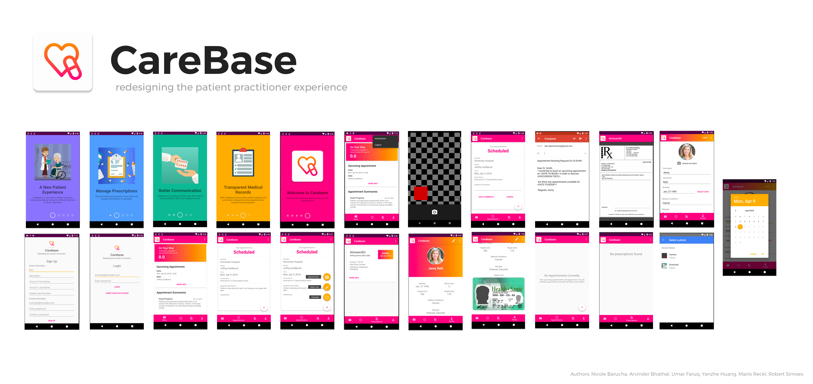

# CareBase

The patient-doctor’s office interaction for patients dealing with the process of cancer treatment, remission, and relapse is very stressful. 

There are few dedicated digital mediums for communicating progress, summaries, recommendations for the treatment leading to decreased transparency of experience, and inefficiencies in managing related information.

CareBase is a new mobile application poised to overcome the barriers and anxiety felt by all parties managing the stressful process of cancer treatment.



## Build & Usage

### Method 1: Android Studio + Emulator

You must install the [Android Studio IDE](https://developer.android.com/studio/index.html) and it's associated emulator with an API level greater than 21. For details on installation emulator please reference: [Run App on the Android Emulator (Google)](https://developer.android.com/studio/run/emulator.html). Ensure that you download an emulator image greater than API 21.

1. Follow instructions at `https://developer.android.com/studio/install.html` to install Android Studio
2. Install `git` from `https://git-scm.com/downloads`
3. In a directory of your choice, run:
```
    $ git clone https://github.com/robertsimoes/carebase.git
```

4. Start Android Studio, and if at the splash screen (no project open), click 'Open an existing Android Studio project' and navigate to the `CareBase` directory created in step 3.

5. Once the CareBase project has opened, follow instructions at `https://developer.android.com/studio/run/managing-avds.html` to set up a virtual device

6. Once virtual device is set up, click on File -> Sync Project with Gradle Files

7. Click on Run -> Run 'app', and choose the virtual device created in step 5 and hit 'Ok'

8. Once app is running, continue reading 'How Carebase is Used' below

### How CareBase is Used
CareBase is designed to be an application used by both patients and health-care practitioners. As such, some features of CareBase such as creating Appointments, Prescriptions, and Summaries are meant to be created by the practitioner side of things. 

To balance this design with testing the functionality of the app, we've created two accounts, Male and Female, that have some Appointments, Prescriptions, and Summaries pre-created. Of course, it is possible to create a new account, however the above elements are not meant to be added from the side of the user. Please refer to the accounts below to login to the app, or register a new account if you prefer.

### Pre-Seeded Accounts

We have created two preset accounts with information provided by doctors to allow exploration the experience of the application in two different profiles. 

#### Jenny Ried

*Account:* jennyreid@yahoo.ca

*Password:* password123


#### Kevin Moe

*Account:* kevinmoe@gmail.com

*Password:* password123

### Method 2: APK

Alternatively, you can install the APK found in the file `assets/carebase-v1.apk` onto a local android phone by connecting to a USB and installing using the `adb` tool. **Note**: you must have the adb tool set install which is generally found as packaged with Android Studio. 

```
+ Carebase 
    + app
    |   ..
    + assets
    |-- carebase-v1.apk
     -- carebase.png

README.md

```

### Method 3: Worst Case Scenario, Appetize

In the worst case scenario we have purchased a brief licence to Appetize providing a simulated experience of using our application. Please note we advise the implementation of the above two methods as primary means to access, and provie this as a last case resort. 

[CareBase Simulation Appetize](https://appetize.io/app/4ypzhd03nj06u5t1fnmahqduj8?device=nexus5&scale=75&orientation=portrait&osVersion=7.1)


## Team

Nicole Barucha, Arvinder Bhathal, Umar Faruq, Yanzhe Huang, Mario Reckl, Robert Simoes

## Licence

CareBase is licenced under Apache 2.0. 

All assets belong to their respective creators, sourced to from Creative Commons repositories. Credits to Vecteezy, FreePik, FreeIcon, and Google Material Deisgn. 
